<div align="center">

# 🤖 SMARTqA - Autonomous QA Agent

### *Intelligent Test Case & Selenium Script Generation from Documentation*

[](https://www.python.org/downloads/)
[](https://streamlit.io/)
[](https://langchain.com/)
[](LICENSE)

*Building a "Testing Brain" with RAG-Powered AI*

</div>

---

## 📋 Table of Contents

- [Overview](#-overview)
- [System Architecture](#-system-architecture)
- [Key Features](#-key-features)
- [How It Works](#-how-it-works)
- [Technology Stack](#-technology-stack)
- [Installation](#-installation)
- [Usage Guide](#-usage-guide)
- [Project Structure](#-project-structure)
- [Workflow](#-workflow)
- [Example Assets](#-example-assets)
- [API Integration](#-api-integration)

---

## 🌟 Overview

**SMARTqA** is an intelligent, autonomous QA agent that revolutionizes test automation by constructing a "testing brain" from your project documentation. It ingests support documents (product specs, UI/UX guides, API endpoints) alongside your HTML structure to generate:

✅ **Comprehensive Test Cases** - Documentation-grounded, zero-hallucination test plans  
✅ **Executable Selenium Scripts** - Production-ready Python automation scripts  
✅ **Knowledge-Based Testing** - RAG (Retrieval-Augmented Generation) powered insights


---

## 🏗️ System Architecture


---

## ⚡ Key Features

### 🧠 **Intelligent Knowledge Base**
- **Multi-Format Support**: PDF, Markdown, TXT, JSON, HTML
- **Vector Search**: FAISS-powered semantic retrieval
- **Local Embeddings**: HuggingFace all-MiniLM-L6-v2 (no API costs)

### 🎯 **Grounded Test Generation**
- **Zero Hallucination**: Test cases strictly based on documentation
- **Source Attribution**: Each test linked to original document
- **Comprehensive Coverage**: Functional, UI, API, and validation tests

### 🔧 **Production-Ready Scripts**
- **Clean Code**: Readable, well-commented Selenium scripts
- **Explicit Waits**: Robust element interaction patterns
- **Error Handling**: Graceful failure management
- **Precise Selectors**: HTML-aware element targeting

### 🎨 **User-Friendly Interface**
- **Drag & Drop**: Easy document upload
- **Real-Time Feedback**: Progress indicators and status updates
- **Tabbed Navigation**: Organized workflow sections
- **Copy & Download**: One-click script export

---

## 🔄 How It Works


---

## 🛠️ Technology Stack


| Component | Technology | Purpose |
|-----------|-----------|---------|
| **UI Framework** | Streamlit | Interactive web interface |
| **LLM Provider** | Google Gemini 2.5 Pro | Test case & script generation |
| **Vector Database** | FAISS | Semantic document search |
| **Embeddings** | HuggingFace MiniLM | Local vector encoding |
| **Orchestration** | LangChain | RAG pipeline management |
| **Automation** | Selenium | Browser test execution |
| **Document Parsing** | BeautifulSoup, PyPDF, Unstructured | Multi-format ingestion |

---

## 📥 Installation

### Prerequisites
- **Python**: 3.8 or higher
- **uv**: Fast Python package installer ([Install uv](https://github.com/astral-sh/uv))
- **Google API Key**: Gemini API access ([Get it here](https://makersuite.google.com/app/apikey))
- **Chrome Browser**: For Selenium execution

### Step-by-Step Setup

```bash
# 1. Clone the repository
git clone https://github.com/AyushPandey003/SMARTqA.git
cd SMARTqA

# 2. Install uv (if not already installed)
pip install uv

# 3. Install dependencies with uv
uv pip install -r requirements.txt

# 4. Set up environment variables
set GOOGLE_API_KEY=your_api_key_here

# 5. Run the application with uv
uv run streamlit run src/app.py
```

### Configuration

Create a `.env` file in the project root:

```env
GOOGLE_API_KEY=your_google_gemini_api_key
```

---

## 📖 Usage Guide

```mermaid
flowchart TD
    Start([🚀 Launch Application]) --> Upload[📁 Upload Documents]
    Upload --> Build[🔨 Build Knowledge Base]
    Build --> Check{Knowledge Base Ready?}
    Check -->|No| Upload
    Check -->|Yes| Requirement[✍️ Enter Test Requirement]
    Requirement --> Generate[⚡ Generate Test Cases]
    Generate --> Review[👀 Review Test Cases]
    Review --> Select[✅ Select Test Case]
    Select --> Script[🤖 Generate Selenium Script]
    Script --> Download[💾 Download Script]
    Download --> Execute[▶️ Execute Tests]
    Execute --> End([✨ Complete])
    
    style Start fill:#C8E6C9,stroke:#388E3C,stroke-width:3px,color:#000
    style Build fill:#BBDEFB,stroke:#1976D2,stroke-width:2px,color:#000
    style Generate fill:#FFE0B2,stroke:#F57C00,stroke-width:2px,color:#000
    style Script fill:#E1BEE7,stroke:#7B1FA2,stroke-width:2px,color:#000
    style End fill:#C8E6C9,stroke:#388E3C,stroke-width:3px,color:#000
```



### Detailed Steps

#### 1️⃣ **Build Knowledge Base**
1. Launch the app: `uv run streamlit run src/app.py`
2. In the sidebar, upload:
   - **Support Documents**: `product_specs.md`, `ui_ux_guide.txt`, `api_endpoints.json`
   - **Target HTML**: `checkout.html`
3. Click **"Build Knowledge Base"**
4. Wait for success message

#### 2️⃣ **Generate Test Cases**
1. Navigate to **"Test Case Generation"** tab
2. Enter a requirement:
   ```
   Test the discount code functionality with valid and invalid codes
   ```
3. Click **"Generate Test Cases"**
4. Review the output JSON with:
   - Test IDs
   - Test scenarios
   - Expected results
   - Source document attribution

#### 3️⃣ **Generate Selenium Scripts**
1. Switch to **"Selenium Script Generation"** tab
2. Paste the test case from Step 2 (or write your own)
3. Click **"Generate Selenium Script"**
4. Copy or download the Python script
5. Run it: `uv run python test_script.py`

---

## 📂 Project Structure

```mermaid
graph TD
    Root[📦 SMARTqA] --> Src[📁 src/]
    Root --> Assets[📁 assets/]
    Root --> FAISS[📁 faiss_db/]
    Root --> Config[📄 Config Files]
    
    Src --> App[🖥️ app.py<br/>Main Streamlit UI]
    Src --> Backend[📁 backend/]
    
    Backend --> Init[__init__.py]
    Backend --> Ingest[📥 ingestion.py<br/>Document Loading]
    Backend --> RAGModule[🔍 rag.py<br/>LLM Initialization]
    Backend --> Gen[⚙️ generation.py<br/>Test & Script Gen]
    
    Assets --> Specs[📋 product_specs.md]
    Assets --> UX[🎨 ui_ux_guide.txt]
    Assets --> API[🔌 api_endpoints.json]
    Assets --> HTML[🌐 checkout.html]
    Assets --> TestApp[📁 ecommerce_test_app/]
    
    FAISS --> Index[🗄️ index.faiss<br/>Vector Database]
    
    Config --> Req[📋 requirements.txt]
    Config --> ReadMe[📖 README.md]
    Config --> Env[🔐 .env]
    
    style App fill:#FFCDD2,stroke:#D32F2F,stroke-width:2px,color:#000
    style Ingest fill:#C8E6C9,stroke:#388E3C,stroke-width:2px,color:#000
    style RAGModule fill:#BBDEFB,stroke:#1976D2,stroke-width:2px,color:#000
    style Gen fill:#E1BEE7,stroke:#7B1FA2,stroke-width:2px,color:#000
```



### Directory Breakdown

```
SMARTqA/
├── src/
│   ├── app.py                    # 🖥️ Main Streamlit application
│   └── backend/
│       ├── __init__.py
│       ├── ingestion.py          # 📥 Document loading & vector DB creation
│       ├── rag.py                # 🔍 LLM initialization (Gemini)
│       └── generation.py         # ⚙️ Test case & Selenium script generation
│
├── assets/
│   ├── product_specs.md          # 📋 E-commerce feature specifications
│   ├── ui_ux_guide.txt           # 🎨 UI/UX design guidelines
│   ├── api_endpoints.json        # 🔌 API documentation
│   ├── checkout.html             # 🌐 Target HTML for testing
│   └── ecommerce_test_app/       # 🛒 Complete Flask test application
│       ├── app.py
│       ├── routes.py
│       ├── models.py
│       └── templates/
│
├── faiss_db/
│   └── index.faiss               # 🗄️ Persistent vector database
│
├── requirements.txt              # 📦 Python dependencies
├── README.md                     # 📖 This documentation
├── .env                          # 🔐 Environment variables
└── test.py                       # 🧪 Test script examples
```

---

## 🔀 Workflow


---

## 📚 Example Assets

### 1. **product_specs.md**
Defines e-commerce features:
- Shopping cart operations (add/remove items)
- Discount code validation rules
- Form field requirements
- Payment method workflows
- Shipping options

### 2. **ui_ux_guide.txt**
Specifies UI behavior:
- Error message styling (red, inline)
- Button states (enabled/disabled)
- Form validation triggers
- Success feedback patterns

### 3. **api_endpoints.json**
Documents API structure:
```json
{
  "validate_discount": {
    "endpoint": "/api/discount/validate",
    "method": "POST",
    "responses": {
      "valid": {"discount": 10, "message": "Valid code"},
      "invalid": {"error": "Invalid code"}
    }
  }
}
```

### 4. **checkout.html**
Target HTML structure with:
- Product catalog (`#product-1`, `#product-2`)
- Cart summary (`#cart-items`, `#total-price`)
- Discount input (`#discount-code`)
- User form (`#name`, `#email`, `#address`)
- Payment buttons (`#pay-now`)

---

## 🔌 API Integration


### Google Gemini Configuration
```python
llm = ChatGoogleGenerativeAI(
    model="gemini-2.5-pro",
    google_api_key=api_key,
    temperature=0.2,
    convert_system_message_to_human=True
)
```

### FAISS Vector Store
```python
embeddings = HuggingFaceEmbeddings(
    model_name="all-MiniLM-L6-v2"
)
vector_db = FAISS.from_documents(texts, embeddings)
```

---

## 🎯 Core Principles


---

## 📊 Key Metrics

| Metric | Value |
|--------|-------|
| **Supported Formats** | 5 (PDF, MD, TXT, JSON, HTML) |
| **Embedding Dimension** | 384 (MiniLM-L6-v2) |
| **Context Window** | 5 documents per query |
| **Chunk Size** | 1000 characters |
| **Chunk Overlap** | 200 characters |
| **LLM Temperature** | 0.2 (deterministic) |
| **Retrieval Strategy** | Semantic similarity (FAISS) |

---

## 🚀 Future Enhancements

- [ ] Support for Playwright/Cypress script generation
- [ ] Multi-language support (JavaScript, TypeScript, Java)
- [ ] Test execution dashboard with live results
- [ ] CI/CD pipeline integration
- [ ] Visual regression testing capabilities
- [ ] API test generation (REST, GraphQL)
- [ ] Performance test scenario creation

---

## 🤝 Contributing

Contributions are welcome! Please follow these steps:

1. Fork the repository
2. Create a feature branch: `git checkout -b feature/amazing-feature`
3. Commit changes: `git commit -m 'Add amazing feature'`
4. Push to branch: `git push origin feature/amazing-feature`
5. Open a Pull Request

---

## 📄 License

This project is licensed under the MIT License - see the [LICENSE](LICENSE) file for details.

---

## 👨‍💻 Author

**Ayush Pandey**
- GitHub: [@AyushPandey003](https://github.com/AyushPandey003)
- Project: [SMARTqA](https://github.com/AyushPandey003/SMARTqA)

---

## 🙏 Acknowledgments

- **LangChain** - For the excellent RAG framework
- **Google Gemini** - For powerful LLM capabilities
- **HuggingFace** - For open-source embeddings
- **Streamlit** - For rapid UI development

---

<div align="center">

### ⭐ If you find this project useful, please give it a star!

**Made with ❤️ and Python**

</div>
